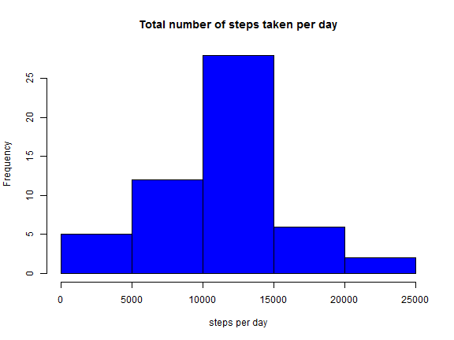
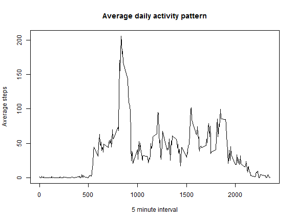
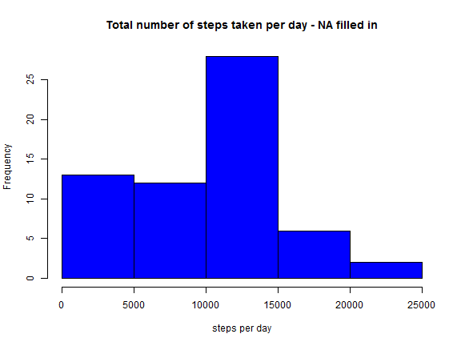
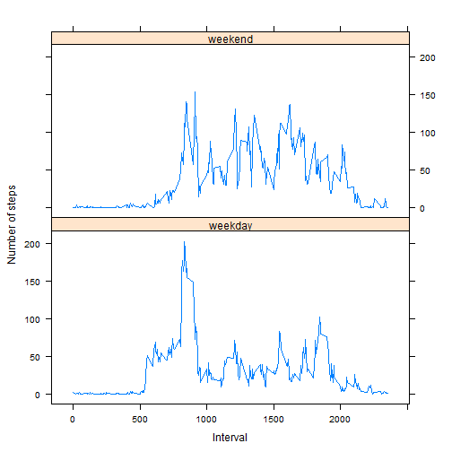

# Reproducible Research - Peer Assessment 1

## Loading and preprocessing the data

Load the data

```r
# load data with unz to unzip - stringAsFactors False to make date conversion easier
data <- read.csv(unz(description="activity.zip",filename="activity.csv"),stringsAsFactors=F)
```

Process/transform the data (if necessary) into a format suitable for your analysis

```r
# date into Date format
data$date <- as.Date(data$date,format="%Y-%m-%d")

# create new dataset without NA 
data_NA <- data[which(data$steps !="NA"),]
```


## What is mean total number of steps taken per day?
For this part of the assignment, you can ignore the missing values in the dataset. *Use data_NA* 

Make a histogram of the total number of steps taken each day

```r
# prepair data for plotting using ddply
require(plyr)
day_steps <- ddply(data_NA,.(date),
                   summarize,
                   steps=sum(steps))
```


```r
# create plot
hist(day_steps$steps,
     xlab="steps per day",
     col="blue",
     main="Total number of steps taken per day")
```

 


Calculate and report the mean and median total number of steps taken per day

```r
meanstep <- mean(day_steps$steps)
meanstep
```

```
## [1] 10766
```

```r
medianstep <- median(day_steps$steps)
medianstep
```

```
## [1] 10765
```

Mean of total number of steps taken per day = **1.0766 &times; 10<sup>4</sup>** 

Median of total number of steps taken per day = **1.0765 &times; 10<sup>4</sup>**


## What is the average daily activity pattern?

Make a time series plot of the 5-minute interval (x-axis) and the average number of steps taken, averaged across all days (y-axis)

```r
# prepair data for plot using ddply
require(plyr)
step_int <- ddply(data_NA,.(interval),
                   summarize,
                   steps=mean(steps))
```


```r
# create plot
plot(x=step_int$interval,y=step_int$steps,
     type="l",
     xlab="5 minute interval",
     ylab="Average steps",
     main="Average daily activity pattern")
```

 


Which 5-minute interval, on average across all the days in the dataset, contains the maximum number of steps?

```r
# Find maximum interval 

stepInt <- step_int[step_int$steps==max(step_int$steps),]
```

The 5 minute interval that contains the maximum number of steps (*206*) is at **835**


## Imputing missing values
Note that there are a number of days/intervals where there are missing values (coded as NA). The presence of missing days may introduce bias into some calculations or summaries of the data.

Calculate and report the total number of missing values in the dataset (i.e. the total number of rows with NAs)

```r
num_missing <- sum(is.na(data)) # only missing values in steps variable
```

The total number of missing values = **2304**

Devise a strategy for filling in all of the missing values in the dataset. The strategy does not need to be sophisticated. For example, you could use the mean/median for that day, or the mean for that 5-minute interval, etc. Create a new dataset that is equal to the original dataset but with the missing data filled in.


```r
# create new data set 
data_NA_filled <- data

# fill in missing values with 0
data_NA_filled[is.na(data_NA_filled)] <- 0

# check if any missing values
sum(is.na(data_NA_filled))
```

```
## [1] 0
```


Make a histogram of the total number of steps taken each day and Calculate and report the mean and median total number of steps taken per day. Do these values differ from the estimates from the first part of the assignment? What is the impact of imputing missing data on the estimates of the total daily number of steps?


```r
# prepair data for plot using plyr
require(plyr)
day_steps_2 <- ddply(data_NA_filled,.(date),
                   summarize,
                   steps=sum(steps))

# create plot
hist(day_steps_2$steps,
     xlab="steps per day",
     col="blue",
     main="Total number of steps taken per day - NA filled in")
```

 

```r
# summary for data with missing values removed
summary(day_steps$steps)
```

```
##    Min. 1st Qu.  Median    Mean 3rd Qu.    Max. 
##      41    8840   10800   10800   13300   21200
```

```r
# summary for data with missing values imputed at 0
summary(day_steps_2$steps)
```

```
##    Min. 1st Qu.  Median    Mean 3rd Qu.    Max. 
##       0    6780   10400    9350   12800   21200
```

```r
meanstep2 <- mean(day_steps_2$steps)
meanstep2
```

```
## [1] 9354
```

```r
medianstep2  <- median(day_steps_2$steps)
medianstep2
```

```
## [1] 10395
```

Mean of total number of steps taken per day with NA removed from dataset = **1.0766 &times; 10<sup>4</sup>** 

Mean of total number of steps taken per day with missing values filled with 0 = **9354** 

Median of total number of steps taken per day with NA removed from dataset = **1.0765 &times; 10<sup>4</sup>**

Median of total number of steps taken per day with missing values filled with 0 = **1.0395 &times; 10<sup>4</sup>**


 1. **Do these values differ from the estimates from the first part of the assignment?** 
    * Yes they differ from the estimate in the first part of the assignment
    
 2. **What is the impact of imputing missing data on the estimates of the total daily number of steps?**
    * By imputing the missing data we have created minimum values that will skew the data. It changes the min, 1 st Qu, Median, Mean, 3rd Qu. 


## Are there differences in activity patterns between weekdays and weekends?
Use the dataset with the filled-in missing values for this part.

Create a new factor variable in the dataset with two levels -- "weekday" and "weekend" indicating whether a given date is a weekday or weekend day.

```r
# creating weekday
weekday <- weekdays(data_NA_filled$date,abbreviate=T)

# create new factor variable from weekday
data_NA_filled$week <- ifelse(weekday%in%c("lau.","sun."),"weekend","weekday")
data_NA_filled$week <- factor(data_NA_filled$week)
```

Make a panel plot containing a time series plot of the 5-minute interval (x-axis) and the average number of steps taken, averaged across all weekday days or weekend days (y-axis).

```r
# prepair data for plot - using ddply
require(plyr)
step_int_week <- ddply(data_NA_filled,.(interval,week),
                   summarize,
                   steps=mean(steps))

# plotting data
require(lattice)
xyplot(step_int_week$steps~step_int_week$interval|step_int_week$week,
       type="l",
       layout=c(1,2),
       xlab="Interval",
       ylab="Number of steps")
```

 
